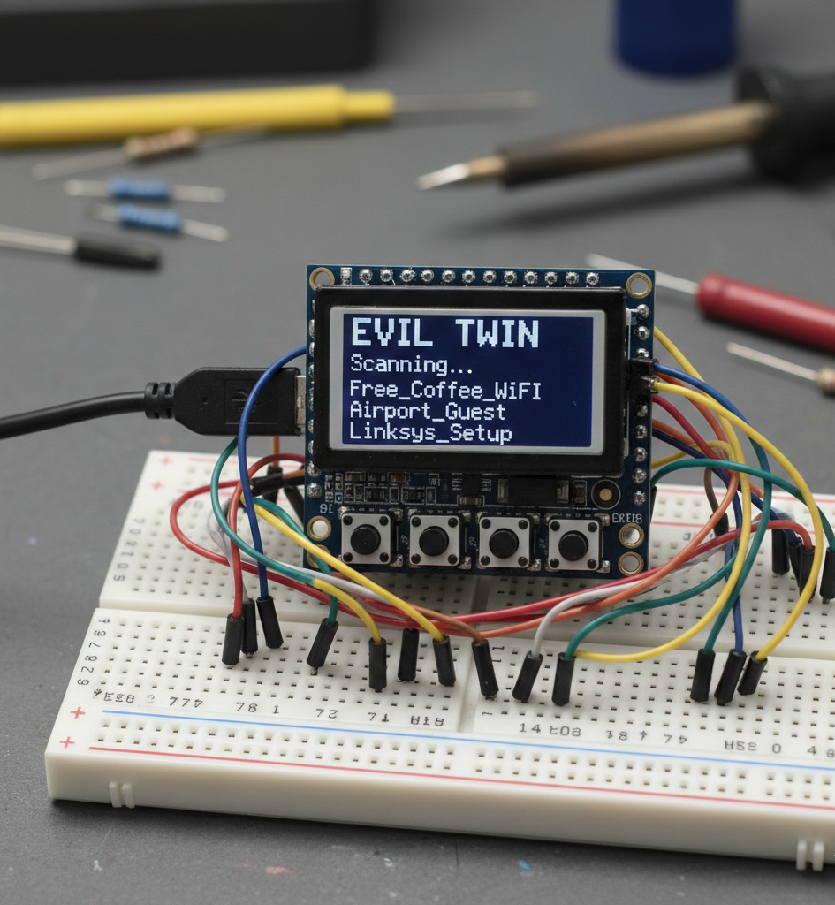

# 📡 ESP8266 Evil Twin - Network Security Simulation

A professional-grade Network Security Research and Simulation Tool designed for the ESP8266 platform. This repository provides an all-in-one hardware and software simulation of the **Evil Twin Attack**—a classic phishing methodology used to demonstrate vulnerabilities in wireless clients and educate users on Wi-Fi security.

---

## 📌 What It Does

The **ESP8266 Evil Twin** demonstrates how rogue access points can impersonate legitimate networks to credential-harvest. Unlike basic captive portal scripts, this project features **Real-time Password Verification** by momentarily checking entered credentials against the target access point. If the credentials fail verification, the victim is prompted to re-enter them; if they succeed, they are persisted locally and the attack automatically stops.

This tool is designed for penetration testers, security educators, and students wanting to explore physical computing and cyber-security simulation on resource-constrained microcontrollers. It features both a physical control panel (OLED display + button controls) and a responsive web-based administration dashboard.

---

## 🌟 Key Features

- **Real-time Verification:** Disconnects temporarily to test captured passwords against the actual target AP (`WL_CONNECTED`), ensuring zero "garbage" credentials.
- **Physical Interface:** Supports a 128x64 I2C OLED display and a 4-button tactile interface (Up, Down, Select, Back) for independent, PC-free field operations.
- **Responsive Admin Panel:** A clean web dashboard (`/menu`) featuring dark/light modes, live connection stats, target scanning, and credential log management.
- **Persistent EEPROM Storage:** Captured logs are stored securely in the ESP8266's EEPROM and persist across system power cycles.
- **Smart Hardware Optimization:** Uses asynchronous scanning and a 500ms button state debounce guard to keep the hardware responsive under CPU loads.
- **Edge-Case Resilience:** Automatically handles DNS redirection for any address requested by connected clients, forcing them to the validation portal page.

---

## 🛠️ Tech Stack

- **Microcontroller Core:** C++ / Arduino Framework (ESP8266 Arduino Core)
- **Web UI & Captive Portal:** Semantic HTML5, Vanilla CSS3 (Variables, Dark/Light theme support), and lightweight JavaScript
- **Hardware Integration:** `Adafruit_SSD1306` & `Adafruit_GFX` libraries (I2C)
- **Data Persistence:** Internal EEPROM emulation

---

## 📸 Media & Screenshots

> [!NOTE]
> Hardware schematics and physical interface references are available in the project directory.

| OLED Display (Physical UI) | Admin Dashboard (`/menu`) | Captive Portal (Victim View) |
|:---:|:---:|:---:|
|  |  |  |

---

## 🔌 Hardware Schematics & Pin Mapping

To build the standalone hardware unit, wire the components according to the diagram below.

### 📐 Connections Diagram
- Refer to [esp8266 oled connection.png](file:///e:/projects/IOT-SIMULATION/EVIL_TWINS_ESP8266/github/ALL%20Connections/esp8266%20oled%20connection.png) and [esp8266 Buttons Connections.png](file:///e:/projects/IOT-SIMULATION/EVIL_TWINS_ESP8266/github/ALL%20Connections/esp8266%20Buttons%20Connections.png) inside the `ALL Connections` directory for complete physical layouts.

### 📌 Pinout Reference

| Component | Pin (ESP8266 / NodeMCU) | GPIO Mapping | Notes |
| :--- | :--- | :--- | :--- |
| **OLED SDA** | D1 | GPIO 5 | I2C Data Line |
| **OLED SCL** | D2 | GPIO 4 | I2C Clock Line |
| **Button UP** | D3 | GPIO 0 | Navigation Up (Internal Pullup) |
| **Button DOWN** | D6 | GPIO 12 | Navigation Down (Internal Pullup) |
| **Button SELECT** | D7 | GPIO 13 | Menu Confirmation (Internal Pullup) |
| **Button BACK** | D5 | GPIO 14 | Back / Cancel Option (Internal Pullup) |

---

## 🚀 Installation & Local Setup

### Option A: Flashing the Pre-compiled Binary (Recommended)
1. Navigate to the `Bin File` directory to locate `EVIL_TWINS_ESP8266.ino.bin`.
2. Connect your NodeMCU or generic ESP8266 to your computer via micro-USB.
3. Open **NodeMCU PyFlasher** (or use `esptool.py` via command line).
4. Configure the following flash parameters:
   - **Flash Mode:** `DIO`
   - **Baud Rate:** `115200`
   - **Flash Frequency:** `160MHz` (Required for handling captive portal web traffic smoothly)
5. Select the bin file and click **Flash**.

### Option B: Compiling from Source
1. **Prerequisites:** Install [Arduino IDE](https://www.arduino.cc/en/software) or VS Code with the [PlatformIO Extension](https://platformio.org/).
2. Add ESP8266 board support via the Boards Manager: `http://arduino.esp8266.com/stable/package_esp8266com_index.json`
3. Install the required libraries via Library Manager:
   - `Adafruit SSD1306` (for the OLED)
   - `Adafruit GFX Library`
4. Open the source sketch directory (`EVIL_TWINS_ESP8266.ino`).
5. Select **NodeMCU 1.0 (ESP-12E Module)**, choose your COM Port, compile, and upload.

---

## 📖 Operational Workflow

1. **Booting up:** Connect power via USB. The OLED display initializes and prints a splash screen.
2. **Scanning:** Use the physical buttons (or the Web Dashboard) to select `Scan Networks`. The system performs an asynchronous scan to record local SSIDs.
3. **Cloning:** Select your target network from the generated list and press the `SELECT` button to launch the attack.
4. **Baiting:** The ESP8266 starts a SoftAP with the same SSID name and redirects any client attempting to access the internet to the local security portal (`192.168.4.1`).
5. **Admin Access:** You can access the management panel at any time by connecting to the AP and navigating to `http://192.168.4.1/menu` in your browser.
6. **Capture:** When a user enters a password, the ESP8266 pauses the AP, connects to the authentic AP, and tests the credentials. Correct credentials stop the simulation and save the password directly to the EEPROM logs.

---

## ⚠️ Disclaimer
**This tool is strictly developed for educational and authorized network security testing purposes only.** 
Unauthorized targeting, intercepting, or credential capturing on communication systems you do not own or lack written permission to audit is illegal. The author (@chetanngavali) and contributors assume no liability for misuse, damages, or violations of privacy laws resulting from using this software.

---

## 🤝 Contributing
Contributions make the open-source community an amazing place to learn, inspire, and create. Please see our [CONTRIBUTING.md](CONTRIBUTING.md) for guidelines on code styling, PR submissions, and setup details.

---

## 📄 License
This project is licensed under the MIT License. See the [LICENSE](LICENSE) file for the full license text.

---

## 👨‍💻 Maintainer & Contact
Developed with 💎 by **Chetan Gavali**  
- **GitHub:** [@chetanngavali](https://github.com/chetanngavali)  
- **Issues:** [GitHub Issues Tracker](https://github.com/chetanngavali/EVIL_TWINS_ESP8266/issues)
