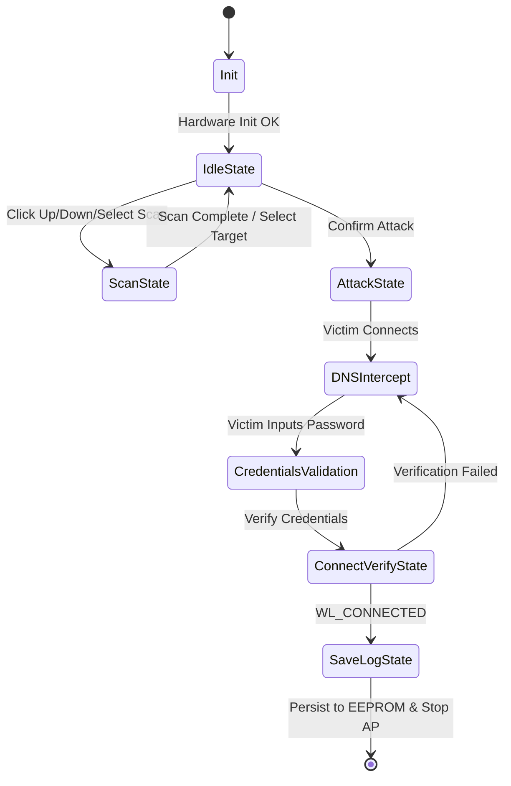
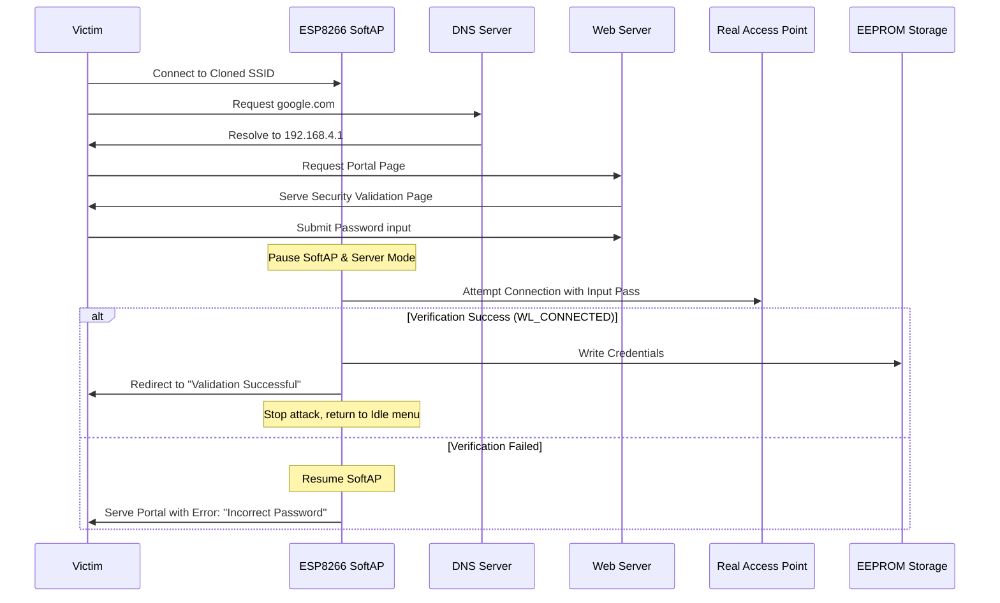

# 📐 Architecture Overview - ESP8266 Evil Twin

This document details the high-level architecture, internal state machines, database/memory map, and data-flow sequences of the ESP8266 Evil Twin Security Simulation.

---

## 1. Architectural Diagram

Below is the state transitions diagram detailing how the microcontroller manages interfaces, DNS routing, and wireless radio states.



---

## 2. Component Modules

The system is organized into modular subsystems that interact asynchronously via the main loop thread:

- **State Machine Manager:** Coordinates transition states between Scanning, Idle, Cloning, Attacking, and Success.
- **Web UI & Captive Portal Engine:** Hosts the Captive Portal page and the `/menu` Web Dashboard. It implements an `onNotFound` wildcard handler redirecting all HTTP requests to `http://192.168.4.1`.
- **DNS Server Component:** A lightweight DNS service resolving all queries (`*`) to the local IP address (`192.168.4.1`) to ensure successful client capture.
- **EEPROM Storage Controller:** Organizes credential storage. An integrity magic-number checks that reads fall within `0` and `20` logs to prevent stack overflows or corrupted pointer reading.
- **Hardware Integration Layer:** Manages button debouncing (500ms state-change lockout) and screen layouts on the 128x64 OLED display.

---

## 3. Data Flow Scenario (Credential Verification)

When a victim connects to the cloned access point and attempts authentication, the following data flow occurs:



---

## 4. EEPROM Storage Map

To guarantee performance persistence on low-RAM chips, records are kept in structured blocks:

```cpp
struct LogEntry {
  char ssid[32];      // Target Access Point name
  char password[64];  // Verified captured password
  bool verified;      // Success flag
};
```

- **EEPROM Header Address [0]:** Contains the active count of recorded passwords (`logCount`).
- **EEPROM Data Address [1-2048]:** Holds an array of `LogEntry` structures. Bounds checking validation executes before reading data blocks to prevent buffer issues.
